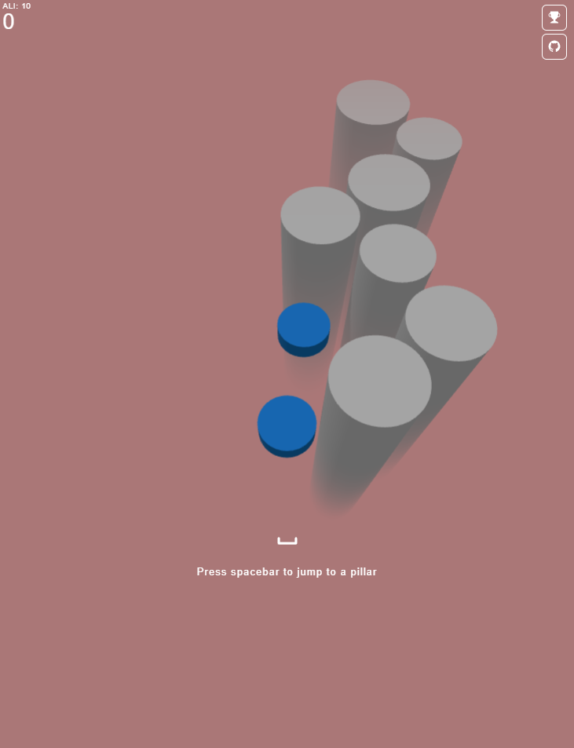

# PillarJump

Play the game: https://pillarjump.web.app/



## Made with Firebase + Vue 3

<span style="text-align: center;">
    
    
</span>
<br>

## Clone and develop

1. Run `git clone https://github.com/amalej/pillarjump.git`
2. Install dependencies

```sh
npm install
```

3. Run the hot-reloader for development

- The command below runs the Firebase Emulators and the Vite hot-reloader

```sh
npm run dev
```

## Build and deploy

1. Run command below to build

```sh
npm run build
```

2. Run command below to deploy

```sh
firebase deploy --project PROJECT_ID
```
